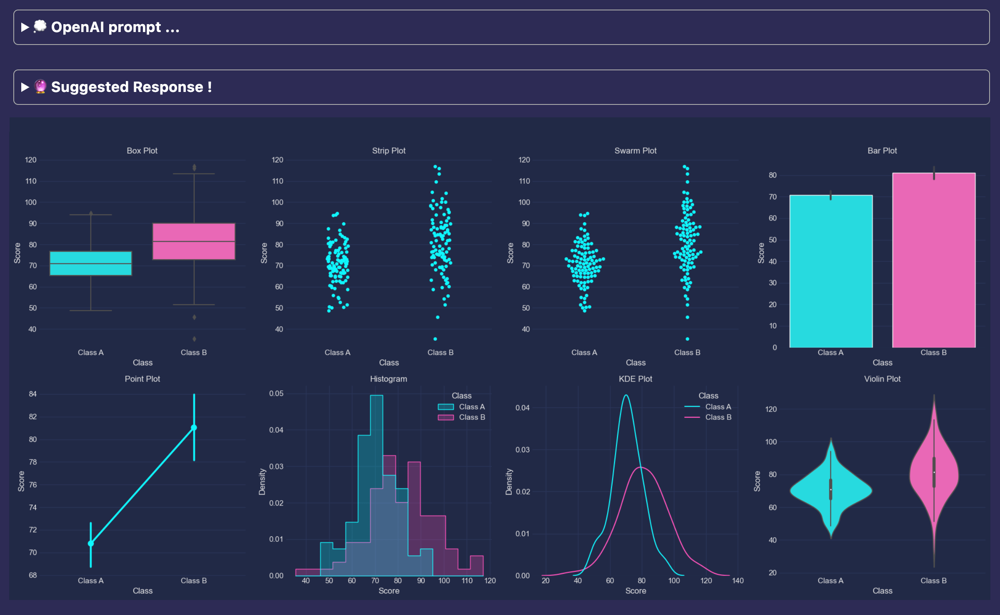

<h1 align="center">
	DreamMyPlots 🌜✨🖼️
</h1>
<p align="center">
  <em>Create plots with LLMs through OpenAI and langchain</em>
</p>
<p align="center">
  
</p>


# DreamMyPlots 🌜✨🖼️

DreamMyPlots is a friendly utility class for anyone doing data science, who want to turn numbers and data into seaborn/matplot plots quickly, through the power of Python's graph-making skills with any popular LLM prompts (through Langchain)to make even complex charts simple to create.

Here's how you can use it:

1. **Provide Data** 📊: Input your DataFrame and what you'd like to visualize.
2. **AI Assists** 🤖: It then uses AI to generate the Python plotting code based on your prompt.
3. **Visualize** 🌟: Run the generated code to see your data transformed into a visual plot.

And this may:

* **Saves Time** ⏰: No need to write complex code from scratch. It's quicker to get your visuals ready.
* **Boosts Creativity** 🎨: Encourages you to experiment with different types of visuals without the heavy lifting.
* **Simplifies Learning** 📘: Makes it easier to jump into data visualization, even if you're new to data science.

```python
import pandas as pd
import numpy as np

df = pd.DataFrame(np.random.rand(100), columns=['A'])
```

## **🌱 How to Begin**

* 💻 Install :
```bash
pip install dream-my-plots
```
or through github tags,
```bash
pip install git+https://github.com/mustafah/dream-my-plots.git@1.0.0
```

* 🔑 Environment variables should contain your [OpenAI](https://platform.openai.com/api-keys) (or other LangChain compliant [LLM](https://python.langchain.com/docs/integrations/chat/)) [API key](https://platform.openai.com/api-keys) :

```bash
# Sample .env file
DREAM_MY_PLOTS_LLM_API_KEY=your-key-here
```

* 📈 Create your dataframe :

```python
import pandas as pd
import numpy as np

df = pd.DataFrame(np.random.rand(100, 3), columns=['A', 'B', 'C'])
```

* 🎨 Dream your plot :

```python
from dream_my_plots import DreamMyPlots
DreamMyPlots(df, """
    Make line plots for first two columns, and first 7 rows !
""")
```

## Examples

#### Comparative Distributions of Two Class Datasets

📈 Create your dataframe :

```python
import numpy as np

# Generating features for Class A & B with normal distribution
features_class_A = np.random.normal(70, 10, 100)
features_class_B = np.random.normal(80, 15, 100)
features = np.concatenate([features_class_A, features_class_B])  # Combining Class A and B features

classes = ['Class A'] * 100 + ['Class B'] * 100  # Creating labels for the classes

import pandas as pd
df = pd.DataFrame({'Feature': features, 'Class': classes})  # Creating DataFrame with features and class labels
```

🌟✍️ Send your prompt :

```python
from dream_my_plots import DreamMyPlots
DreamMyPlots(df, """
    📊 Make a plot contains 6 kinds of Distribution Plots (Categorical and Continuous Distribution plots)
    🎨 Give a large title please, fit upto 4 subplots horizontally
""")
```



## 💬✨ More to say

### Commenting

You use # character to comment any line in prompt, so it will be not sent to the LLM

```python
from dream_my_plots import DreamMyPlots
DreamMyPlots(df, """
    📊 Make a plot contains 6 kinds of Distribution Plots (Categorical and Continuous Distribution plots)
    # 🎨 Give a large title please, fit upto 4 subplots horizontally
""")
```

### 🌑 Dark theme

Set an environment with value of `DARK` or `LIGHT` for the syntax higlight

```bash
DREAM_MY_PLOTS_THEME=DARK
```

or send it as a parameter in the class

```python
from dream_my_plots import DreamMyPlots
DreamMyPlots(df, """
    Make a scatter plot !
""", dark=True)
```

### 🔑 API key

You can pass it directly instead of using .env files (not recommended)

```python
from dream_my_plots import DreamMyPlots
DreamMyPlots(df, """
    Make a histogram plot !
""", api_key="*****")
```

### Errors !

Try to rexecute your code, as it is or add more specifications to the prompt ... You are last error and generated code is automatically attached when you resend your prompts

### 📝🔧 Custom Prompt Template (🌱 🇦lpha version)

```python
from langchain.prompts.prompt import PromptTemplate
template = PromptTemplate(
    input_variables=["df", "prompt", "previous_code", "previous_error"], template="your custom template content"
)

from dream_my_plots import DreamMyPlots
DreamMyPlots(df, """
    Make a histogram plot !
""", prompt="*****", template)
```

### 💬🔧 Custom LLM (🌱 🇦lpha version)

It's based on langchain, you can use your custom llm provider

```python
from langchain.chat_models import AzureChatOpenAI

from dream_my_plots import DreamMyPlots
DreamMyPlots(df, """
    Make a histogram plot !
""", llm=AzureChatOpenAI(deployment_name="YOUR_DEPLOYMENT_NAME", openai_api_version="2023-05-15", openai_api_key=openai_api_key, ...))
```
